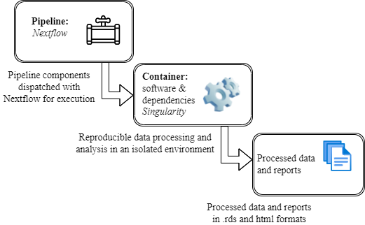

# Nextflow script for automating the exectution of LuminexPipeline utility

This is a nextflow program specifically customised for the LuminexPipeline utility (https://github.com/Asimeng/LuminexPipeline). It orchestrates and streamlines all the pre-processing and analytical steps to prevent human intervention, a major source of not attaining analytical reproducibility during Luminex data processing and analysis. 

This program only runs on the command line.To run it, one would first need to edit the `nextflow.config` file with the appropriate paths and parameters. That is, the parameters for input files, instrument names, analyte reference, and the
path to the execution environment or container (<a href=https://github.com/Asimeng/LuminexPipeline_container>build from here</a>). 

Once this is done, the pipeline can be dispatched with the command below:

`nextflow run path/to/nextflow/script.nf`

Alternatively, one can dispatch the pipeline by setting the parameter values alongside the command to run the nextflow script.

<figure>
    
    <figcaption>Schematic flow of the LuminexPipeline execution. The pipeline is dispatched with the Nextflow workflow management system for execution in a Singularity container. The end of pipeline execution generates the pipeline outputs saved on the host computer.</figcaption>
</figure>

